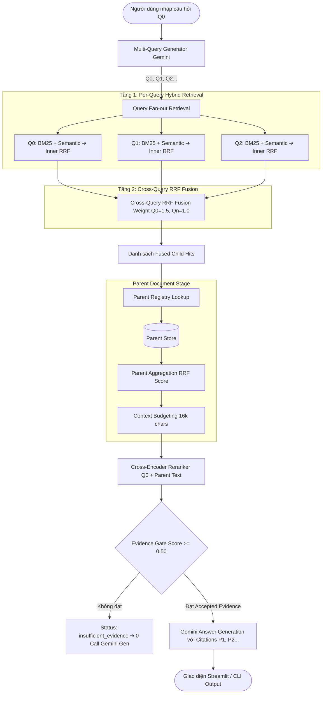

# RAG Foundation — Buổi 09: Multi-Query Expansion & Parent–Child Retrieval Engine

  
  
  


/>

Dự án RAG Nâng Cao dành cho văn bản quy phạm pháp luật ngân hàng Việt Nam, tích hợp **Mở rộng truy vấn Đa nhánh (Multi-Query Expansion)**, **Dung hợp 2 Tầng Reciprocal Rank Fusion (Cross-Query RRF)** và **Kiến trúc Mở rộng Ngữ cảnh Parent–Child (Retrieve Child, Return Parent)**.

---

## 1. 🎯 Mục Tiêu & Sự Khác Biệt Giữa Buổi 08 và Buổi 09

- **Buổi 08 (Baseline)**: Thực hiện RAG phẳng (Flat Chunk RAG) trên các đoạn văn bản độc lập. Chỉ nhận 1 câu hỏi duy nhất, tìm kiếm vector + BM25 đơn nhánh và trả về trực tiếp các đoạn chunk nhỏ.
- **Buổi 09 (Advanced Multi-Query & Parent–Child RAG)**:
  1. **Multi-Query Expansion**: Tự động mở rộng 1 câu hỏi gốc $Q_0$ thành $N$ câu hỏi tìm kiếm biến thể ($Q_1..Q_n$) covering các góc độ thuật ngữ pháp lý, diễn đạt tương đương và khía cạnh thiếu.
  2. **Dung hợp 2 Tầng RRF (Cross-Query RRF Fusion)**: Chạy tìm kiếm Hybrid độc lập cho từng query, sau đó hợp nhất kết quả tìm kiếm đa nhánh bằng công thức Cross-Query RRF có trọng số ($Q_0: 1.5$, $Q_i: 1.0$).
  3. **Kiến trúc Parent–Child (Retrieve Child, Return Parent)**: Tìm kiếm trên các Child Chunk nhỏ để đảm bảo độ chính xác cao, sau đó tự động tra cứu registry mở rộng thành Parent Document nguyên bản chứa ngữ cảnh điều khoản pháp lý đầy đủ.
  4. **Ma Trận Query-Child & Parent-Child Explorer**: Giao diện Streamlit 5 Tabs trực quan hóa minh bạch ma trận Rank truy xuất và sự di chuyển thứ hạng của Parent trước/sau Cross-Encoder Rerank.

---

## 2. 📐 Sơ Đồ Kiến Trúc Pipeline 2 Tầng Fusion & Parent Expansion



---

## 3. 📊 So Sánh 4 Modes Retrieval Pipeline

| Mode | Query Expansion | Level Retrieval | Cross-Query RRF | Target Reranked | Kết Quả Trả Về |
|---|---|---|---|---|---|
| **`single_flat`** | ❌ (Chỉ $Q_0$) | Child Chunk | ❌ | Child Chunk | Top Child Hits (Gốc Buổi 08) |
| **`multi_flat`** | ✅ ($Q_0 + N$ Variants) | Child Chunk | ✅ (Tầng 2) | Child Chunk | Top Fused Child Hits |
| **`single_parent`** | ❌ (Chỉ $Q_0$) | Child $\rightarrow$ Parent | ❌ | Parent Document | Top Parent Documents |
| **`multi_parent`** | ✅ ($Q_0 + N$ Variants) | Child $\rightarrow$ Parent | ✅ (Tầng 2) | Parent Document | **Top Fused & Expanded Parent Docs** |

---

## 4. 📁 Cấu Trúc Dự Án & Thiết Lập `.env`

```text
rag_foundation/buoi_09/
├── .env.example
├── requirements.txt
├── rag.py                   # Snapshot baseline Buổi 08
├── advanced_rag.py          # Snapshot baseline Buổi 08
├── hierarchical_rag.py      # Core Module Buổi 09 (Hierarchy, Multi-Query, Parent RAG, CLI)
├── evaluate.py              # Evaluator 4 Modes tự động
├── app.py                   # Streamlit 5 Tabs Explorer
├── README.md                # Tài liệu hướng dẫn
├── SPEC_buoi_09.md          # Specification kỹ thuật Buổi 09
├── eval/
│   └── questions.json       # Tập câu hỏi kiểm thử 5 thể loại
├── reports/                 # Chứa báo cáo đánh giá tự động JSON
├── storage/
│   ├── chroma/              # Vector database persistent
│   ├── hierarchy/           # Store nguyên tử (children.json, parents.json, manifest.json)
│   └── huggingface/         # Reranker model cache
└── tests/                   # Test suite 72 unit tests 100% offline
    ├── test_hierarchy.py
    ├── test_multi_query.py
    ├── test_cross_query_rrf.py
    ├── test_parent_expansion.py
    ├── test_pipeline.py
    ├── test_ui_helpers.py
    └── test_evaluator.py
```

### Thiết Lập Tệp `.env`
Tạo tệp `.env` tại `rag_foundation/buoi_09/.env`:
```ini
GEMINI_API_KEY=AIzaSyYourActualGeminiApiKeyHere
MULTI_QUERY_COUNT=3
MULTI_QUERY_MAX_CHARS=300
MULTI_QUERY_TEMPERATURE=0.2
MULTI_QUERY_ORIGINAL_WEIGHT=1.5
MULTI_QUERY_VARIANT_WEIGHT=1.0
MULTI_QUERY_RRF_K=60
PER_QUERY_CANDIDATES=12
PARENT_MAX_CHARS=6000
PARENT_SCORE_CHILD_LIMIT=3
PARENT_RRF_K=60
PARENT_CANDIDATES=10
FINAL_PARENT_TOP_K=3
TOTAL_CONTEXT_MAX_CHARS=16000
EMBEDDING_MODEL=gemini-embedding-2
EMBEDDING_DIM=768
GENERATION_MODEL=gemini-3.5-flash-lite
RERANKER_MODEL=BAAI/bge-reranker-v2-m3
RERANK_MIN_SCORE=0.50
RERANK_DEVICE=auto
```

---

## 5. 🛠️ Khởi Tạo Hierarchy Registry & Thứ Tự Ưu Tiên Phân Giải

Hierarchy Registry chuyển đổi các đoạn chunks nhỏ thành Parent Document (điều khoản) bằng thứ tự ưu tiên 4 tầng:
1. **Priority 1: Structural Metadata**: Cấu trúc `chapter` và `article` có sẵn trong metadata chunk.
2. **Priority 2: Heading Inferred at Line Start**: Nhận diện dòng bắt đầu bằng `^#+ Điều \d+` hoặc `^Điều \d+\.`. (Các cụm "Điều N" xuất hiện giữa câu trích dẫn không bị nhầm là Heading).
3. **Priority 3: Carry Forward trong Cùng Source**: Truyền tiếp thông tin Điều/Chương cho các chunk nối tiếp của **cùng một tệp PDF nguồn**. Tuyệt đối không truyền sang tệp PDF khác.
4. **Priority 4: Document Fallback**: Gán `parent_<source>_doc_fallback` khi văn bản không có tiêu đề điều khoản.

Các trường hợp mâu thuẫn giữa Metadata và Heading Inferred được đánh nhãn `ambiguous = True` kèm warning minh bạch.

---

## 6. 📝 Multi-Query Expansion & Ngân Sách Gọi API (API Call Budget)

- **Cam kết Q0**: $Q_0$ luôn là câu hỏi gốc do mã nguồn tạo trực tiếp (`origin: original`). Gemini LLM chỉ sinh các biến thể $Q_1..Q_n$.
- **Bảo vệ Số Điều**: Bộ lọc tự động loại bỏ các query biến thể bịa thêm số Điều mới không xuất hiện trong $Q_0$.
- **In-Process Singleton Cache**: Hash SHA-256 câu hỏi gốc để cache biến thể trong bộ nhớ process, tránh gọi lại API khi lặp câu hỏi.
- **Giới hạn API Call**: Trong 1 lượt hỏi đáp mode `multi_parent`:
  - **Tối đa 2 Gemini Generation API Calls**: (1 call sinh query variants + 1 call sinh câu trả lời).
  - Các cuộc gọi Embedding API để vectorize $Q_0..Q_n$ được đếm riêng tại `embedding_calls`.

---

## 7. 🧮 Công Thức Toán Học Dung Hợp 2 Tầng & Parent Aggregation

### Tầng 1: Inner Hybrid RRF (BM25 + Semantic Vector)
$$\text{Inner\_RRF}(d) = \frac{1}{60 + r_{\text{bm25}}(d)} + \frac{1}{60 + r_{\text{sem}}(d)}$$

### Tầng 2: Cross-Query RRF Fusion
$$\text{MQ\_RRF}(d) = \sum_{q \in Q} \frac{w_q}{60 + r_q(d)}$$
*(Với $w_{Q0} = 1.5$, $w_{Qn} = 1.0$, $r_q(d)$ là thứ hạng Inner Fused Rank của child $d$ trong query $q$)*.

### Parent Aggregation Score
$$\text{Parent\_RRF}(p) = \sum_{c \in \text{Top } 3 \text{ Scoring Children of } p} \frac{1}{60 + \text{multi\_query\_rank}(c)}$$

---

## 8. 🔍 Quy Trình Retrieve Child, Return Parent & Parent Reranking

1. Retrieval tìm kiếm trên các child chunks nhỏ.
2. Tra cứu registry chuyển đổi fused child hits thành Parent Documents.
3. Chấm điểm lại Parent Candidates bằng Cross-Encoder Reranker với cặp câu hỏi `(original_question, parent_text)`.
4. Tính điểm Sigmoid chuẩn hóa:
   $$\text{parent\_rerank\_score} = \frac{1}{1 + e^{-\text{logit}}}$$
5. Lọc bằng chứng qua Evidence Gate (`parent_rerank_score >= 0.50`).

---

## 9. 💻 Hướng Dẫn Sử Dụng Các Lệnh CLI

Mọi lệnh được thực thi thông qua Python Virtual Environment:

```powershell
# 1. Kiểm tra trạng thái Hierarchy Store (Read-only)
.\rag_foundation\buoi_05\.venv\Scripts\python.exe .\rag_foundation\buoi_09\hierarchical_rag.py hierarchy-status

# 2. Xây dựng lại Hierarchy Store nguyên tử
.\rag_foundation\buoi_05\.venv\Scripts\python.exe .\rag_foundation\buoi_09\hierarchical_rag.py build-hierarchy

# 3. Thử nghiệm sinh biến thể câu hỏi (Expand Query)
.\rag_foundation\buoi_05\.venv\Scripts\python.exe .\rag_foundation\buoi_09\hierarchical_rag.py expand-query --question "Điều kiện vay vốn ngân hàng là gì?"

# 4. Thử nghiệm Multi-Query Child Search
.\rag_foundation\buoi_05\.venv\Scripts\python.exe .\rag_foundation\buoi_09\hierarchical_rag.py multi-child --question "Điều kiện vay vốn là gì?"

# 5. Thử nghiệm Parent Expansion & Aggregation
.\rag_foundation\buoi_05\.venv\Scripts\python.exe .\rag_foundation\buoi_09\hierarchical_rag.py parent-retrieve --mode multi_parent --question "Điều kiện vay vốn là gì?"

# 6. Chạy RAG Pipeline hoàn chỉnh (Query Mode)
.\rag_foundation\buoi_05\.venv\Scripts\python.exe .\rag_foundation\buoi_09\hierarchical_rag.py query --mode multi_parent --question "Điều kiện vay vốn và các trường hợp không được cho vay là gì?"

# 7. So sánh 4 Retrieval Modes (Compare Mode - 0 Answer Gen Call)
.\rag_foundation\buoi_05\.venv\Scripts\python.exe .\rag_foundation\buoi_09\hierarchical_rag.py compare --question "Điều kiện vay vốn và các trường hợp không được cho vay là gì?"

# 8. Chạy Đánh Giá Tự Động 4 Modes (Evaluator)
.\rag_foundation\buoi_05\.venv\Scripts\python.exe .\rag_foundation\buoi_09\evaluate.py

# 9. Khởi Chạy Ứng Dụng Streamlit Explorer
.\rag_foundation\buoi_05\.venv\Scripts\python.exe -m streamlit run .\rag_foundation\buoi_09\app.py
```

---

## 10. 🎛️ Hướng Dẫn Tuning Tham Số & Context Budget

- `PER_QUERY_CANDIDATES` (Mặc định 12): Số lượng child candidates thu thập từ mỗi query.
- `PARENT_CANDIDATES` (Mặc định 10): Số lượng parent candidates giữ lại trước tầng reranking.
- `FINAL_PARENT_TOP_K` (Mặc định 3): Số lượng parent documents được chấp nhận đưa vào prompt sinh câu trả lời.
- `TOTAL_CONTEXT_MAX_CHARS` (Mặc định 16,000 chars): Giới hạn ngân sách ký tự context. Cắt ngắt duy nhất tại ranh giới Parent Document.

---

## 11. 📈 Đánh Giá Chất Lượng & Giới Hạn Gold Labels

- Các chỉ số được tính tự động trong `evaluate.py`:
  - **Child Recall@K**: Tỷ lệ tìm lại các child chunks đúng.
  - **Parent Recall@K**: Tỷ lệ tìm lại các điều khoản parent đúng.
  - **MRR@K**: Vị trí xuất hiện của bằng chứng đúng đầu tiên.
  - **nDCG@K**: Điểm tích lũy giảm dần có trọng số vị trí.
- **Giới hạn Gold Labels**: Tất cả câu hỏi đánh giá trong `eval/questions.json` có gắn cờ `"needs_human_review": true`. Hệ thống không tự tuyên bố một mode vượt trội tuyệt đối nếu chưa qua kiểm định của chuyên gia pháp lý.

---

## 12. 🔧 Xử Lý Lỗi Thường Gặp (Troubleshooting)

- **Lỗi `hierarchy_not_ready`**: Chạy lệnh `build-hierarchy` để tạo Hierarchy Store.
- **Lỗi `GEMINI_API_KEY chưa được cấu hình`**: Kiểm tra tệp `.env` tại `rag_foundation/buoi_09/.env`.
- **Status `insufficient_evidence`**: Không có văn bản nào đạt điểm tin cậy Rerank $\ge 0.50$. Cần điều chỉnh câu hỏi hoặc kiểm tra dữ liệu nạp.

---

## 13. ⚖️ Tuyên Bố Miễn Trách Nhiệm (Legal Disclaimer)

Hệ thống RAG này được phát triển phục vụ mục đích tìm kiếm, tra cứu và tổng hợp thông tin văn bản quy phạm pháp luật ngân hàng. Kết quả sinh ra bởi mô hình AI **không cấu thành lời tư vấn pháp lý chính thức**. Người sử dụng cần đối chiếu lại với Công báo và Văn bản quy phạm pháp luật gốc do Ngân hàng Nhà nước Việt Nam ban hành.
