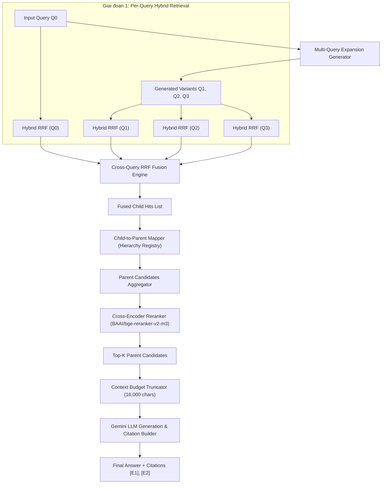

# SPECIFICATION ĐẶC TẢ KỸ THUẬT BUỔI 09

---

## 1. Mục Tiêu & Khác Biệt Giữa Buổi 08 và Buổi 09

| Tiêu chí | Buổi 08 (Advanced RAG Baseline) | Buổi 09 (Hierarchical Multi-Query RAG) |
|---|---|---|
| **Xử lý Truy vấn Input** | Tìm kiếm trực tiếp bằng câu hỏi gốc $Q_0$ duy nhất. | Sinh $N=3$ câu hỏi biến thể ($Q_1, Q_2, Q_3$) qua LLM + Heuristic fallback. |
| **Giai đoạn Dung hợp** | BM25 + Semantic Hybrid RRF ($k=60$) trên đơn truy vấn. | Dung hợp 2 tầng: Per-Query Hybrid RRF + Cross-Query RRF trên $N+1$ truy vấn. |
| **Phạm vi Bằng chứng (Grounding Unit)** | Trả về các **Child Chunks riêng lẻ** (Flat Chunks). | Mở rộng Child Chunks về **Parent Document (Điều/Chương)** nguyên vẹn ngữ cảnh. |
| **Giai đoạn Reranking** | Cross-Encoder Reranking trên các Child Chunks. | Cross-Encoder Reranking trên các **Parent Candidates** đã gom nhóm. |
| **Giới hạn Context Prompt** | Cắt Top-K Child Chunks theo số lượng $K$. | Quản lý Context Budget nghiêm ngặt (**16,000 ký tự**) chống vỡ cửa sổ ngữ cảnh. |

---

## 2. Sơ Đồ Quy Trình Xử Lý Chi Tiết (Pipeline Architecture Diagram)



---

## 3. Định Nghĩa 4 Chế Độ Truy Xuất (Retrieval Modes)

1. **`single_flat`**: Baseline Buổi 08 — Dùng $Q_0$ duy nhất, truy xuất Child Chunks (Flat RRF), không mở rộng Parent.
2. **`multi_flat`**: Dùng $Q_0 + N$ Variants, Cross-Query RRF trên Child Chunks, không mở rộng Parent.
3. **`single_parent`**: Dùng $Q_0$ duy nhất, truy xuất Child Chunks -> Ánh xạ & Gom nhóm về Parent Documents -> Rerank Parent.
4. **`multi_parent`**: Đầy đủ tính năng Buổi 09 — $Q_0 + N$ Variants -> Cross-Query RRF -> Ánh xạ Parent -> Aggregation -> Rerank Parent.

---

## 4. QueryVariant Schema & Validation Rules

```python
class QueryVariant:
    variant_id: str          # Ví dụ: "Q0" (gốc), "Q1", "Q2", "Q3" (biến thể)
    query_text: str          # Nội dung câu hỏi
    weight: float            # Trọng số RRF (Q0: 1.5, Variants: 1.0)
    is_original: bool        # True cho Q0, False cho biến thể
```

- **Validation Rules**:
  - `query_text` không được rỗng hoặc chỉ chứa khoảng trắng.
  - Số ký tự tối đa `len(query_text) <= MULTI_QUERY_MAX_CHARS` (300 ký tự).
  - Loại bỏ các biến thể trùng lặp hoàn toàn với $Q_0$ hoặc với nhau.

---

## 5. Hierarchy Registry Schema

```python
class HierarchyRegistry:
    parent_map: Dict[str, ParentDocument]   # Key: parent_id -> Value: ParentDocument
    child_to_parent: Dict[str, str]          # Key: child_chunk_id -> Value: parent_id
```

---

## 6. ParentDocument Schema

```python
class ParentDocument:
    parent_id: str               # Ví dụ: "parent_TT_02_2023_NHNN_Điều_4"
    source: str                  # Ví dụ: "TT_02_2023_NHNN.pdf"
    title: str                   # Ví dụ: "Điều 4. Cơ cấu lại thời hạn trả nợ"
    chapter: Optional[str]       # Chương (nếu có)
    article: Optional[str]       # Điều (nếu có)
    full_text: str               # Nội dung đầy đủ của Điều/Chương
    child_ids: List[str]         # Danh sách các child_chunk_id thuộc parent này
    page_start: int              # Trang bắt đầu
    page_end: int                # Trang kết thúc
```

---

## 7. MultiQueryChildHit & ParentCandidate Schema

```python
class MultiQueryChildHit:
    chunk_id: str
    text: str
    source: str
    page_start: int
    page_end: int
    matched_queries: List[str]   # Danh sách query_id đã tìm thấy chunk này (e.g. ["Q0", "Q2"])
    cross_rrf_score: float       # Điểm RRF hợp nhất từ đa truy vấn

class ParentCandidate:
    parent_id: str
    parent_doc: ParentDocument
    child_hits: List[MultiQueryChildHit]
    aggregated_score: float      # Điểm số tích lũy từ các child hits
    rerank_score: Optional[float]# Điểm Cross-Encoder Reranker (Sigmoid [0,1])
    rerank_rank: Optional[int]   # Thứ hạng sau Rerank
```

---

## 8. Quy Tắc Hierarchy Resolution & Ambiguous Warning

1. **Hierarchy Resolution**:
   - Nếu child chunk chứa thông tin `## Điều X` trong text -> Tự động ánh xạ về Parent Document tương ứng `parent_<source>_Điều_X`.
   - Nếu child chunk thuộc phần Quy định chung không ghi rõ Điều -> Ánh xạ về Parent Document đại diện cấp Chương hoặc Phần.
2. **Ambiguous Warning**:
   - Nếu child chunk không thể phân giải chắc chắn về 1 parent_id duy nhất -> Phát ghi nhận cảnh báo `ambiguous_hierarchy_warning` vào danh sách `warnings` của trace và gán nhãn parent dự phòng.

---

## 9. Công Thức Cross-Query RRF & Parent Aggregation

### 📐 Công thức Cross-Query RRF:
$$\text{RRF\_Score}(c) = \sum_{q \in Q} w_q \times \frac{1}{k_{\text{rrf}} + r_q(c)}$$

Trong đó:
- $Q = \{Q_0, Q_1, Q_2, Q_3\}$
- $w_{Q0} = 1.5$ (Trọng số câu hỏi gốc), $w_{Q_i} = 1.0$ (Trọng số biến thể)
- $k_{\text{rrf}} = 60$
- $r_q(c)$: Thứ hạng của child chunk $c$ trong kết quả tìm kiếm của truy vấn $q$.

### 📐 Công thức Parent Aggregation Score:
$$\text{Aggregated\_Score}(P) = \sum_{c \in \text{Top } M \text{ Child Hits of } P} \text{Cross\_RRF\_Score}(c)$$

Trong đó $M = \text{PARENT\_SCORE\_CHILD\_LIMIT}$ (tối đa 3 child hits hàng đầu của Parent $P$).

---

## 10. Context Budget & Citation Contract

1. **Context Budgeting**:
   - Ngưỡng giới hạn tổng ký tự đưa vào Prompt: `TOTAL_CONTEXT_MAX_CHARS = 16000`.
   - Các Parent Candidates được thêm lần lượt theo `rerank_rank`. Nếu thêm Parent tiếp theo vượt quá 16,000 ký tự -> Cắt bớt phần thừa hoặc dừng ở Parent trước đó.
2. **Citation Contract**:
   - Nhãn trích dẫn có dạng `[E1]`, `[E2]`,... ứng với từng Parent Document được chấp nhận (`accepted = True`).
   - Mọi câu khẳng định trong câu trả lời LLM bắt buộc đính kèm nhãn `[E1]`.

---

## 11. Status / Failure Contract

- `"answered"`: Tìm thấy bằng chứng phù hợp và sinh câu trả lời thành công.
- `"insufficient_evidence"`: Tất cả Parent Candidates có điểm Rerank score < `RERANK_MIN_SCORE` (0.50) hoặc rỗng.
- `"retrieval_only"`: Thực thi tìm kiếm thành công với `call_generation = False`.
- `"multi_query_failed"`: Sinh câu hỏi biến thể thất bại -> Tự động chuyển về fallback dùng $Q_0$ duy nhất kèm cảnh báo warning.

---

## 12. Testability & Dependency Injection

- Giao diện hàm hỗ trợ tham số injection:
  - `reranker_fn`: Hàm reranker giả lập cho kiểm thử offline không nạp weights.
  - `gen_fn`: Hàm generation giả lập cho kiểm thử offline không gọi Gemini API mạng.
- Tất cả unit tests Buổi 09 chạy offline 100%, 0 calls Gemini API real, 0 download weights.

---

## 13. Metrics Đánh Giá & Acceptance Criteria

- **Chỉ số Đánh giá**: `Recall@K`, `MRR@K`, `nDCG@K`, Latency P50/mean.
- **Acceptance Criteria**:
  - `multi_parent` cải thiện chỉ số `Recall@K` và `MRR@K` so với baseline `single_flat` (Buổi 08).
  - 100% Unit Tests Buổi 09 PASS.

---

## 14. Xác Nhận Ghi Phạm Vi (Scope Isolation)

Tất cả mã nguồn, cấu hình, dữ liệu và kiểm thử thuộc Buổi 09 được lưu trữ độc lập tuyệt đối tại:
`rag_foundation/buoi_09/`

Tuyệt đối không chỉnh sửa hoặc ảnh hưởng đến các thư mục `buoi_05`, `buoi_06`, `buoi_07`, `buoi_08`.
